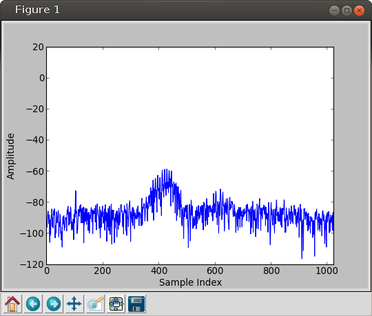

Basic Examples
==============

show_i_q.py
-----------

This example connects to a device specified on the command line,
tunes it to a center frequency of 2.450 MHz
then reads and displays one capture of 1024 i, q values.

.. literalinclude:: ../examples/show_i_q.py

Example output (truncated):

.. code-block:: none

   0,-20
   -8,-16
   0,-24
   -8,-12
   0,-32
   24,-24
   32,-16
   -12,-24
   -20,0
   12,-32
   32,-4
   0,12
   -20,-16
   -48,16
   -12,12
   0,-36
   4,-12

plot_fft.py
-----------

This example connects to a device specified on the command line,
tunes it to a center frequency of 2.450 MHz
and sets a trigger for a signal with an amplitude of -70 dBm or
greater between 2.400 MHz and 2.480 MHz.

When the trigger is satisfied the data is captured and rendered
as a spectrum display using NumPy_ and matplotlib_.

.. _NumPy: http://numpy.scipy.org/
.. _matplotlib: http://matplotlib.org/

.. literalinclude:: ../examples/plot_fft.py

   Example output of ``plot_fft.py``

