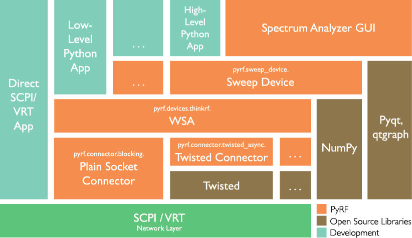
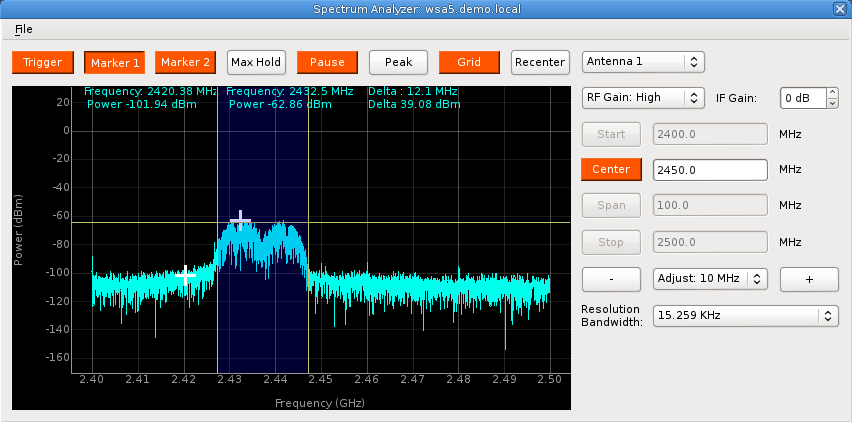
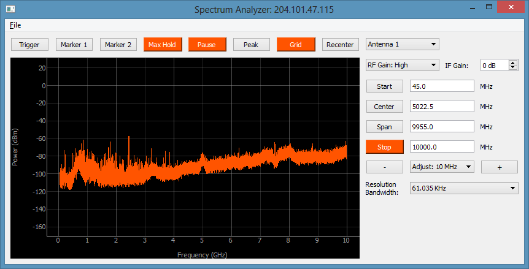

PyRF Documentation
==================

Contents:

.. toctree::
   :maxdepth: 2

   usermanual
   reference
   examples

PyRF is an openly available, comprehensive development environment for wireless signal analysis. It enables rapid development of powerful applications that leverage the new generation of measurement-grade software-defined radio technology.

PyRF is built on the Python Programming Language and includes feature-rich libraries, example applications and source code, all specific to the requirements of signal analysis. PyRF is openly available, allowing commercialization of solutions through BSD open licensing and offering device independence via standard hardware APIs. PyRF handles the low-level details of real-time acquisition, signal processing and visualization, allowing you to concentrate on your analysis solutions.

Hardware Support
----------------

This library currently supports development for the
`ThinkRF WSA4000 and WSA5000`_ platforms.

.. _ThinkRF WSA4000 and WSA5000: http://www.thinkrf.com/

Links
-----

* `Official github page <https://github.com/pyrf/pyrf>`_
* `Documentation for this API <http://www.pyrf.org>`_
* `WSA4000/WSA5000 Documentation <http://www.thinkrf.com/resources>`_

Spectrum Analyzer GUI
---------------------

Indices and tables
==================

* :ref:`genindex`
* :ref:`search`

