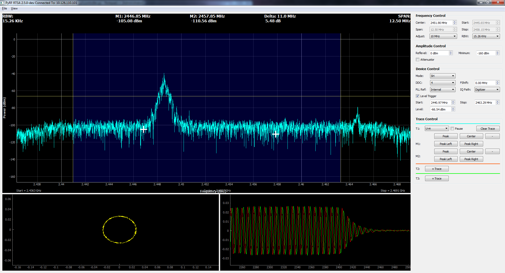

Manual
======

.. image:: pyrf_logo.png
   :alt: PyRF logo

Installation
------------

Windows Dependencies
~~~~~~~~~~~~~~~~~~~~

1. Download https://s3.amazonaws.com/ThinkRF/Support-Resources/pyrf-dependencies.zip
2. Extract the contents of the zipped file
3. Install Python 2.7.6 (python-2.7.6.msi)
4. Add the following to the windows PATH ';C:\Python27;C:\Python27\Scripts'
5. Install Numpy (numpy-1.8.1-win32-superpack-python2.7)
6. Install Scipy (scipy-0.14.0-win32-superpack-python2.7)
7. Install Pyside (PySide-1.2.0.win32-py2.7)
8. Install Pyqtgraph (pyqtgraph-0.9.8.win32)
9. Install zope.interface (zope.interface-4.1.1.win32-py2.7)
10. Install twisted (Twisted-14.0.0.win32-py2.7)
11. Install pywin32 (pywin32-219.win32-py2.7)
12. Install netifaces (netifaces-0.10.4.win32-py2.7)
13. Using a command line, go to the qtreactor-qtreactor-pyrf-1.0 folder, and type 'setup.py install'
14. Using a command line, go to the setuptools-5.7 folder and type 'setup.py install'

Continue from :ref:`pyrf-installation` below.

Debian/Ubuntu Dependencies
~~~~~~~~~~~~~~~~~~~~~~~~~~

Use packaged requirements::

   apt-get install python-pyside python-twisted python-numpy \
   	python-zope.interface python-pip python-scipy python-setuptools \
   	python-pyqtgraph python-netifaces
   pip install -e git://github.com/pyrf/qtreactor.git#egg=qtreactor

Or install GUI requirements from source::

   apt-get install qt-sdk python-dev cmake \
	libblas-dev libatlas-dev liblapack-dev gfortran
   export BLAS=/usr/lib/libblas/libblas.so
   export ATLAS=/usr/lib/atlas-base/libatlas.so
   export LAPACK=/usr/lib/lapack/liblapack.so
   pip install -r requirements.txt

Continue from :ref:`pyrf-installation` below.

.. _pyrf-installation:

PyRF Installation
~~~~~~~~~~~~~~~~~

Download the development version::

   git clone git://github.com/pyrf/pyrf.git
   cd pyrf
   python setup.py install

Or `download a stable release <https://github.com/pyrf/pyrf/releases>`_, then
from the source directory::

   python setup.py install

API for WSA RF Receiver
-----------------------

:class:`pyrf.devices.thinkrf.WSA` is the class that provides access
to WSA4000 and WSA5000 devices.
Its methods closely match the SCPI Command Set described in the
Programmers Reference available in
`ThinkRF Resources <http://www.thinkrf.com/resources>`_.

There are simple examples that use this API under the "examples" directory
included with the source code.

This API may be used in a blocking mode (the default) or in an asynchronous
mode with using the `Twisted`_ python library.

In blocking mode all methods that read from the device will wait
to receive a response before returning.

In asynchronous mode all methods will send their commands to the device and
then immediately return a Twisted Deferred object.  If you need to wait for
the response or completion of this command you can attach a callback to the
Deferred object and the Twisted reactor will call it when ready.  You may
choose to use Twisted's inlineCallbacks function decorator to write Twisted
code that resembles synchronous code by yielding the Deferred objects
returned from the API.

To use the asynchronous when a WSA instance is created
you must pass a :class:`pyrf.connectors.twisted_async.TwistedConnector`
instance as the connector parameter, as in :ref:`twisted-show-i-q`

.. _demo-gui:

PyRF RTSA
---------

.. image:: rtsa-gui-2.png
   :alt: rtsa-gui screen shot

``rtsa-gui`` is a cross-platform GUI application built with the
Qt_ toolkit and PySideProject_ bindings for Python.

.. _Qt: http://qt.digia.com/
.. _PySideProject: http://qt-project.org/wiki/PySide

The GUI may be launched with the command::

  rtsa-gui <hostname> [--reset]

If *hostname* is not specified a dialog will appear asking you to enter one.
If ``--reset`` is used the WSA will be reset to defaults before the GUI
appears.

